1) Install mlflow
```
pip install mlflow
```
2) To check the User Interface
```
mlflow ui
```
### First run (Logged metrics and params using MLflow)
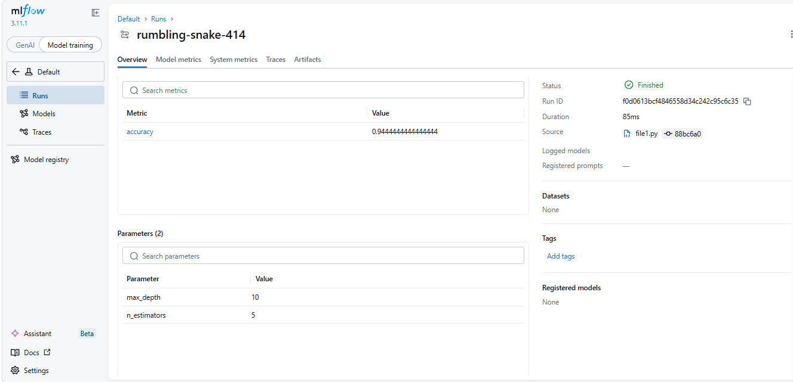
4) Find the mlflow artifact scheme with 
```
mlflow.get_tracking_uri()
```
5) Set tracking URI for artifact scheme, server running on this. This is initially in sqlite format, convert it to http/https format. 
```
mlflow.set_tracking_uri("http://127.0.0.1:5000/")
```

6) Explicitly set the experiment name to ensure that the run is logged under the correct experiment
```
mlflow.set_experiment("<exp-name>")
```
or 

set the exp id inside the mlrun code
```
with mlflow.start_run(experiment_id=):
```

7) Set remote tracking server via Dagshub
```
pip install dagshub
```

8) Autolog logs everything like params(all possible params of the model), metrics, artifacts, models except the script
```
mlflow.autolog()
```


# OUTPUTS

### Logged Artifacts using MLflow
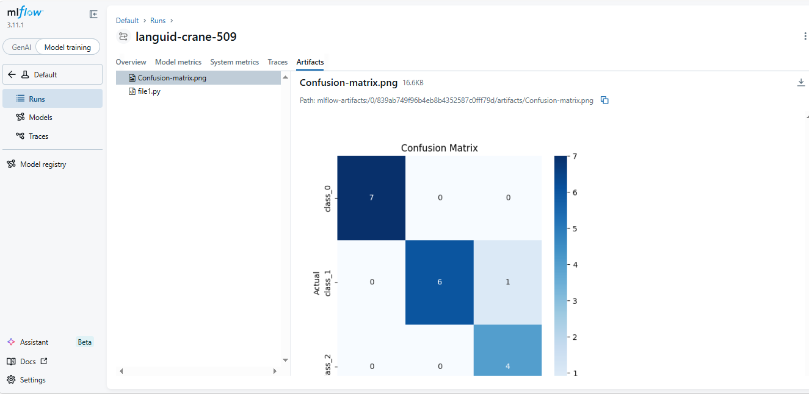

### Experiment vs Run (Visual understanding)
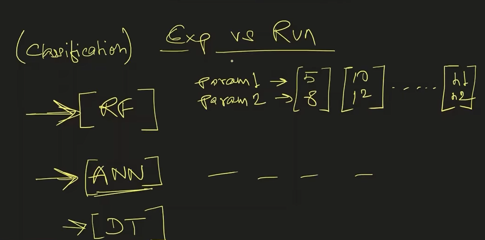

### Logged the model along with its dependencies
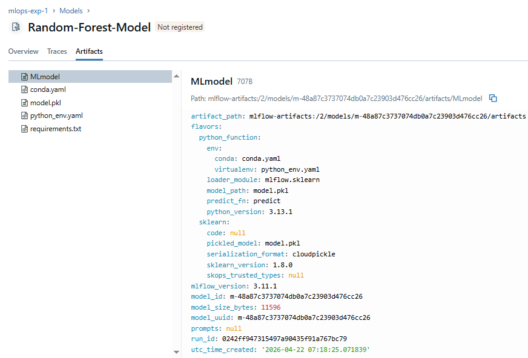

### Added tags 
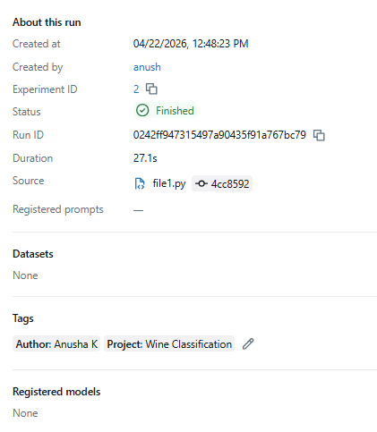

### MLflow Server Architecture
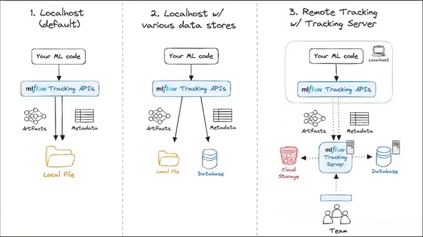

### Dagshub connected
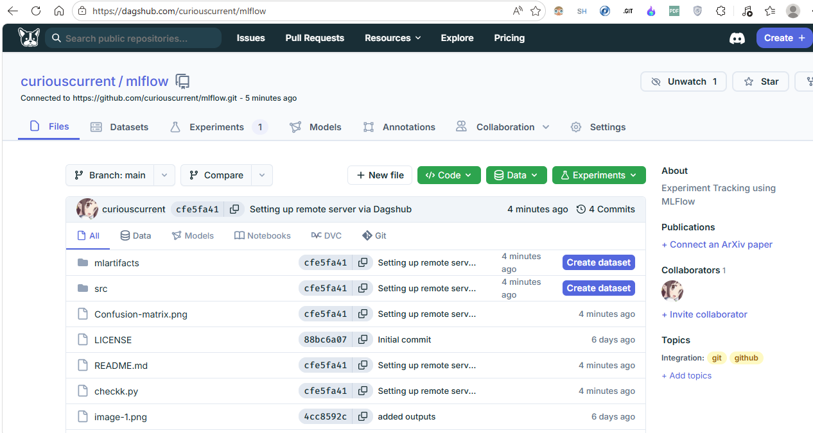

### Remote Mlflow server setup using Dagshub
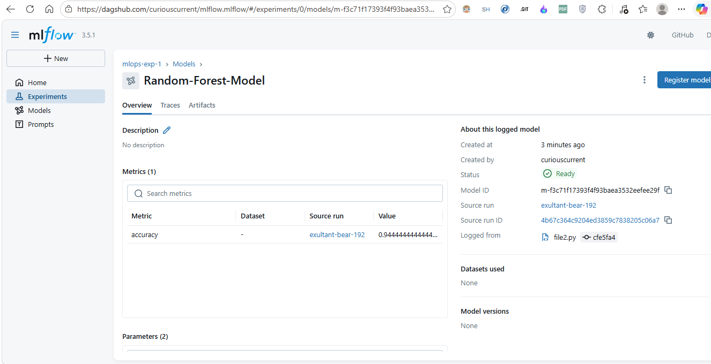

### Logged artifacts, params, datasets, models using Autologging
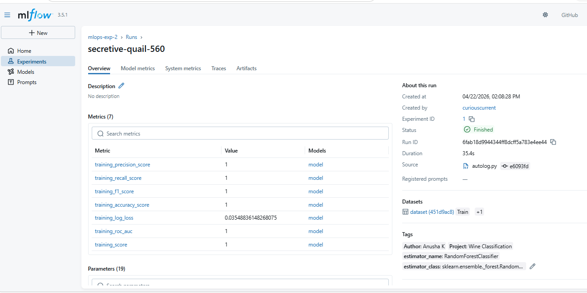
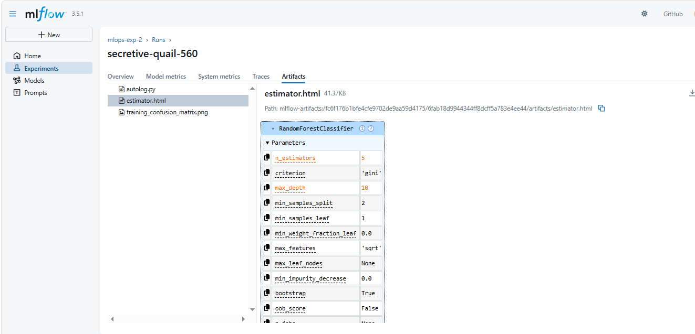


### Hyperparameter tuning using Mlflow
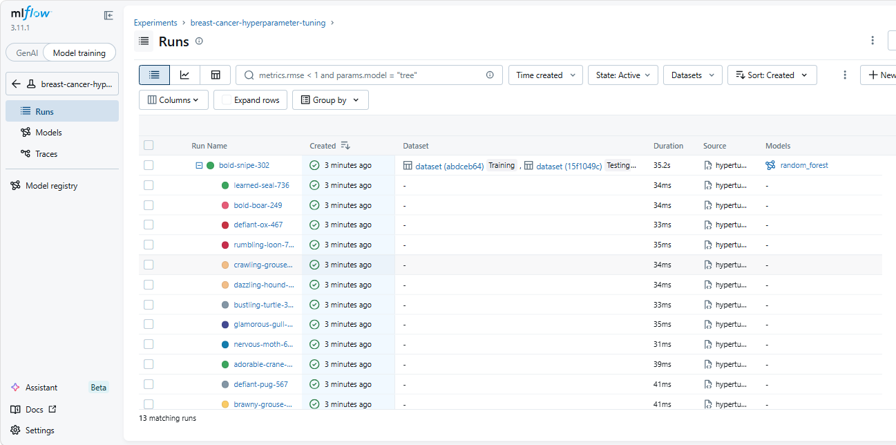
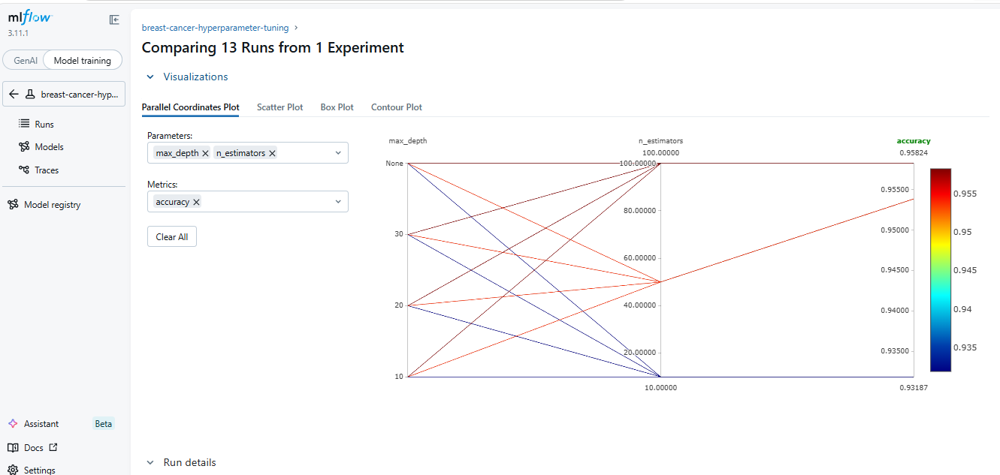

### Stages of Model Registry


### Model registry performed.
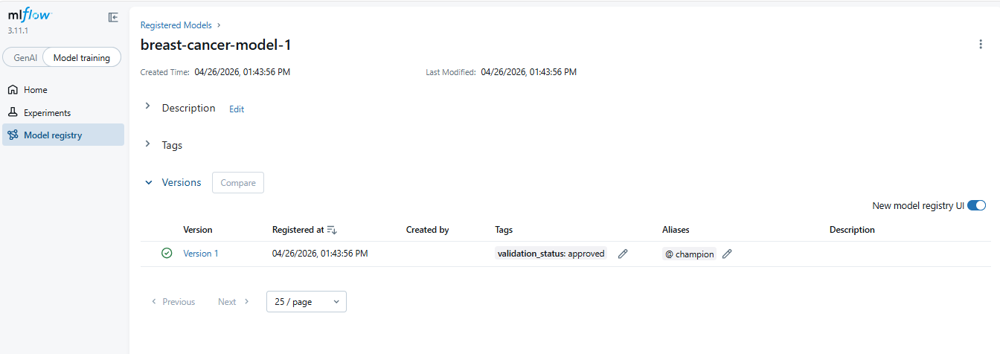